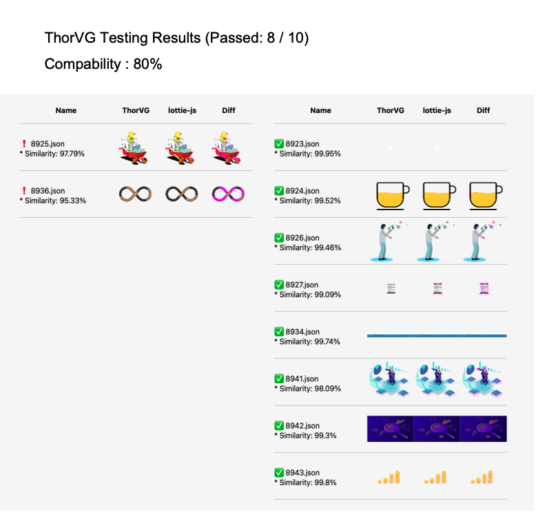
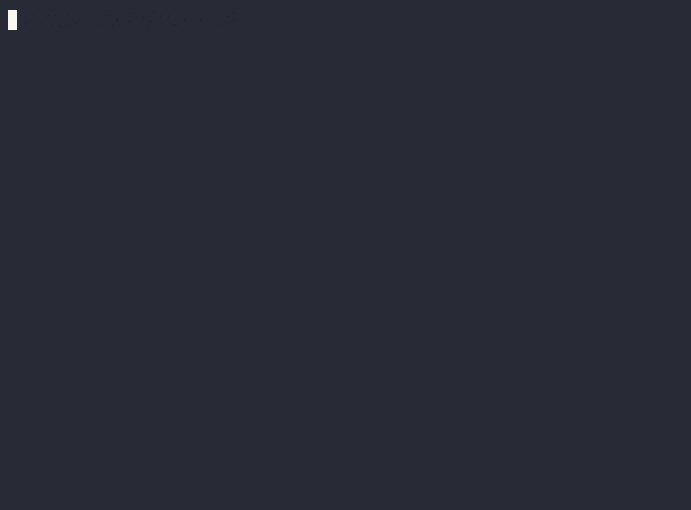

# ThorVG Tester

```
⚠️ [WIP] This currently supports comparing ThorVG to only LottieFiles
```

ThorVG Tester is unofficial graphic renderer testing tool for ThorVG Engine. It works on web browser and detects rendering error by comparing canvas outputs, automatically.

https://github.com/tinyjin/thorvg.tester/assets/11167117/b4df338a-d4e1-4671-b1ca-c4ccc1fdf3ec


## Usage

Click to use [ThorVG Tester](https://thorvg-tester.vercel.app)

### Review with PDF

When test is done, system will download and open PDF that includes testing results, you can simply check and review.



### Manual classify

It's really struggling to move each files to appropriate dirs (ex_ `./passed`, `./failed`) after tests.

System will automatically copy to your clipboard a shell script, this helps you to classify.

The sample code is this.
```sh
mkdir -p ./passed ./failed; mv 8923.json 8924.json 8926.json 8927.json 8934.json 8941.json 8942.json 8943.json ./passed; mv 8925.json 8936.json ./failed;
```

Just put this code in the folder then files will be classified as same as test results



## Others

[ThorVG Project](https://github.com/thorvg/thorvg)
